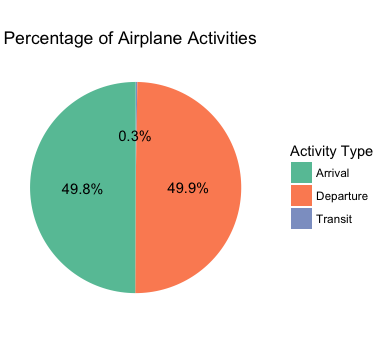
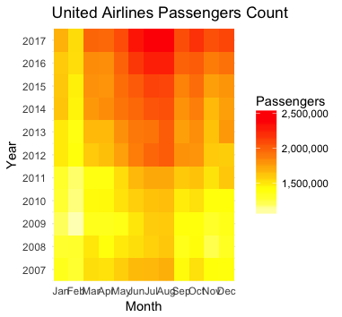

# EDA

We have did some EDA for the data set, we have visualized: 
1 - Line Chart for passenger count by year  
 
2 - Bar Chart for passenger count with geo_summ by month 
 
3 - Line Chart for growth rate 
 
4 - Pie Chart for passenger type 
 
5 - Found the top 5 airlines in passenger counts by domestic and international 
 
6 - Bar Chart for passenger count for international low cost carrier 
 
7 - Tree map for terminal traffic 
 
8 - Heatmap for United Passenger count 
 