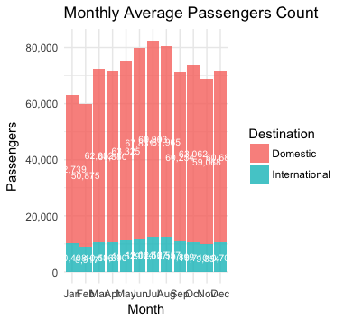
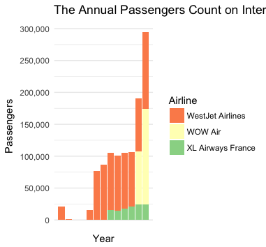

# EDA

We have a data set on SFO traffic between July, 2005 and Decemeber, 2017. It includes the passenger counts on each airline every month in the given period. The data set consists of 12 columns with 17,959 observations, and you may find more detail about the data set in the [Data Folder](../../Data). I have been doing EDA on this data set previously with <a href="https://github.com/chunheisiu">Charles Siu</a>. Some of the EDA visualizations in here is collaboration with him.
  

## Overview
1 - Line Chart for passenger count by year  
 
In the last 10 years, we can see there is a steady growth in passenger traffic in SFO overall.
  
2 - Bar Chart for passenger count with geo_summ by month 
 
We can see there is about 20% of the passengers in SFO are international travellers (Including passengers from/to Canada) while the remaining proportions are domestic travellers. The passenger traffic has a more consistent pattern, it indicates international flights has less seasonality effection. 

## Passenger Growth
3 - Line Chart for growth rate 
 
The growth rate in the past 10 years remain in the positive terrority, ranging from 0.5% to 8.5% growth. It suggests the passenger traffic growth is less sensitive to economic downturns since we know that there are a couple years some airports experience negative growth in a economic recession.

## Passenger Demographics
4 - Pie Chart for passenger type 
 
There is no surprise there are roughly 50-50 distribution on departure and arrival. Note that there are 0.3% airplanes are transit flights because of data inconsistency. We do not have any information on the definition of transit flights. However, since the airplane activity does not affect our prediction so we may ignore the discrepancy.
  
5 - Bar Chart for passenger count for international low cost carrier 
 
There is a rapid growth in passenger traffic in international low cost flights, provided by WestJet (Canada), Wow Air (Iceland), and XL Airways France. 
  
## Terminal Usage
6 - Tree map for terminal traffic 
 
This is the distribution of the passenger traffic by terminal and airlines, we can see most of the SFO passengers take the United flights in terminal 3, followed by American Airlines, Southwest Airlines, Delta Airlines.

## Largest Stalkholder
7 - Heatmap for United Passenger count 
 
From the tree map we have seen, we have learnt United Airlines is the largest stalkholder in SFO. Let's drill down the passenger count with United flights: we can see the colour turn from yellow to red in a steady increasingly pace in the last 10 years.

## Prediction
You may go back to the [Part 1 folder](../) to learn more about the prediction model and its result.