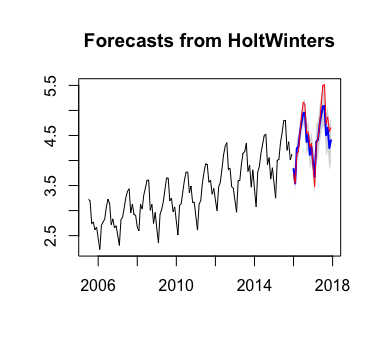
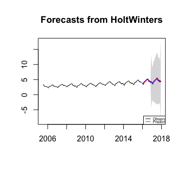
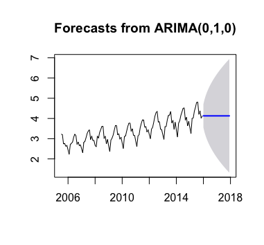
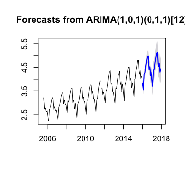
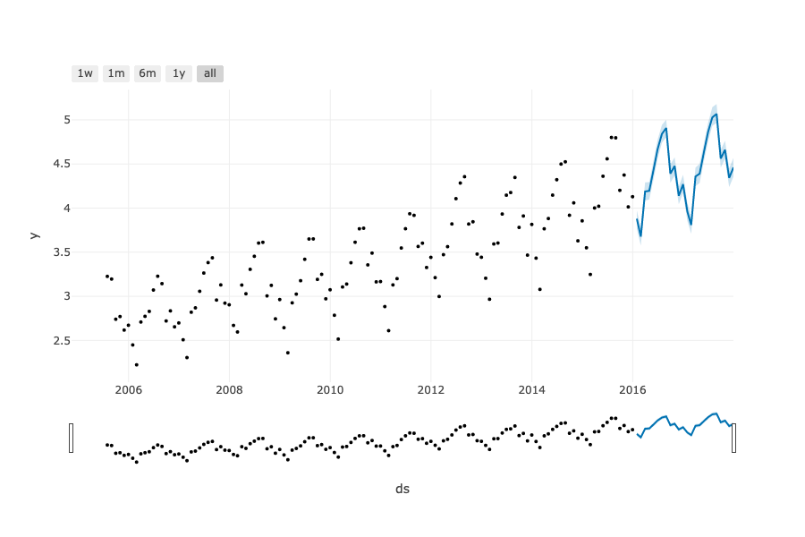
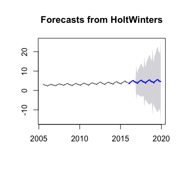
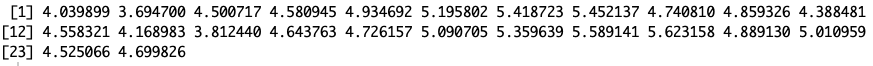

# Part 1 - SFO Passenger Traffic Prediction (2018-2019)/ Original Work

We have a data set on SFO traffic between July, 2005 and Decemeber, 2017. It includes the passenger counts on each airline every month in the given period. I have two goals for this project: 
1 - Visualize the data set for EDA purpose 
2 - Predict the passenger traffic and growth rate in 2018 and 2019  

In this part of the project, I will use R because I would like to demonstrate the functionality of ggplot and R has a better package for time series model. And since Facebook has released a new time-series statistical-learning package, Prophet (Python package), I will also use Python and Prophet to predict the passenger traffic in order to compare the prediction accuracy. 

Noted that I have been doing EDA on this data set previously with <a href="https://github.com/chunheisiu">Charles Siu</a>. Some of the EDA visualizations in here is collaboration with him. 

## About the data set
The data set is an open source data set obtained from DataSF 
<a href="https://datasf.org/opendata/">Open SF</a>

The data set consists of 12 columns with 17,959 observations, and you may find more detail about the data set in the [Data Folder](../Data).

## Goal and Plan
The goal of this part of the project is to utilize the data set to predict the passenger traffic between 2018-2019 in SFO. In order to do this, we will take the following steps to achieve our goal: 
<ol>
	<li>Data Cleansing</li>
	<li>EDA</li>
	<li>Model Training</li>
	<li>Model Validation</li>
	<li>Prediction</li>
</ol>

## Files
There are 2 R scripts and 1 Python script can be found in this folder or subfolder:
<ul>
	<li>SFOTrafficEDA.R - The EDA R script (Located in the [EDA folder](/EDA) )</li>
	<li>sfotraffic.R - The model training R script</li>
	<li>sfotraffic.py - The model training Python script</li>
</ul>

## Data Cleansing
In both the EDA and model training R script, we have changed the column names and you may find the detail in the [Data Folder](../Data) under the section <i>Original Data Set (For Part 1)</i>. 
 
 
When we look at the data set in the previous project, we found that there are entries with inaccurate data or uncleaned data. Such as: 
1 - Some entries with United Airlines is recorded as United Airlines - Pre 07/01/2013 
2 - Emirates are typed inconsistently, some entries are typed with extra whitespace 
3 - Some airlines are recorded as low cost carrier but supposed to be full service ailrine, and the other way around 
 
Therefore, in both the EDA R script, we have made the following changes to make the data be more consistent and accurated visualizations:
<ol>
	<li>Unify the <i>United Airlines</i> entries, make any entry related to United Airlines to have a consistent record in the airline columns.</li>
	<li>Omit the extra whitespace in any <i>Emirates</i> entry in the airline columns.</li>
	<li>Reclassify the wrongly identified airlines in the price categories</li>
</ol>
  
In the model training R and Python script, we have only restructured the date columns and aggregate the passenger count column by month/year for model training. The passenger count column is now count in millions.

## EDA
You may learn more about the data set in the [EDA folder](/EDA).

## Predict the passenger traffic in 2018 and 2019
#### Problem on time series data
Autocorrelation occurs in the data set, it means that a given data point is highly correlated with data point(s) from previous period. It violates one of the assumption of linear regression, so we need to predict in other approach. In this project, I will demostrate 3 approaches. 
 
We will split the whole data set about 80:20 split. The training set is roughly 10 years, or between 2005 and 2015. The reminding data of 2016 and 2017 is validation set.
 
 
We will use RMSE for model evaluation.

## Approach 1: Holt-Winters Method
Holt-Winters Methods predicts by using exponential smoothing techniques, in other words, the model is learned by taking an exponentially weighted moving average and do not need any assumption.  

The model plot is learned as follow: 

 
The RMSE of this model is 0.1946

 
The model was learned in additive exponentially weighted moving average. Another option is to use multiplicative exponentially weighted moving average.  

The model using multiplicative exponentially weighted moving average plot is below: 

 
The RMSE of this model is 0.1342

## Approach 2: Box-Jenkins Method
Box-Jenkins Method is an autoregressive integrated moving average model which is learned by converting the data set into stationary. In this project, we use ARIMA and SARIMA models. The difference between the two is that ARIMA is non-seasonal while SARIMA is seasonal.

#### ARIMA
For the sake of simplicity, we will use "auto.arima()" function to skip the steps on determine the hypermeters on ARIMA and SARIMA models. 
 
Using "auto.arima()" function found the best fit is ARIMA(0,1,0). 
The model plot is learned as follow: 

 
It looks like the forecast is constant, simply because our ARIMA model is fitted by only taking difference from the last period.  
The RMSE of this model is 0.6746

#### SARIMA
Using "auto.arima()" function found the best fit is SARIMA(0,1,0)(0,1,1)[12]. 
Using "auto.arima()" function found the best fit is ARIMA(0,1,0). 
The model plot is learned as follow: 

 
The RMSE of this model is 0.1812

## Approach 3: Linear Model
Recently, Facebook release a new time series package for R and Python called Facebook Prophet. You may find more information at <a href="https://facebook.github.io/prophet/">this website</a>. Therefore, I have given a shot to try to use.

However, only linear model is available in this package. Box-Jenkins Methods and Holt-Winters Methods are not available in this package.
 
The script first changed the column names, reformat the date column, and aggregate the passenger count in Month/Year in millions. Then immediately fit the data set to the training model.
 
The model plot is learned as follow: 

 
The RMSE of this model is 1.0493 which is higher than either Holt-Winters or Box-Jerkins models.

Feel free to read my blog to learn more about my feedback of using Facebook Prophet in Python: 
<a href="https://medium.com/@jjsham/trying-facebook-prophet-for-time-series-model-3170cfd416fa">click here</a>

## Result
Compare the RMSE among all models we learned, we found that multiplicative Holt-Winters is best on prediction. We will use this model to predict passenger counts between 2018 and 2019. 
The model plot is learned as follow: 

 
The result of prediction between January, 2018 and December 2019 are: 

