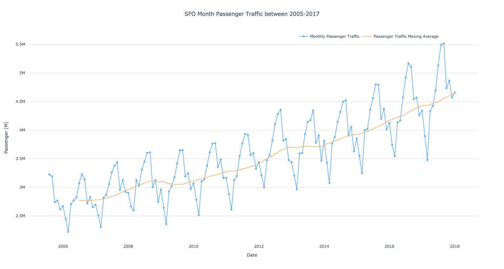
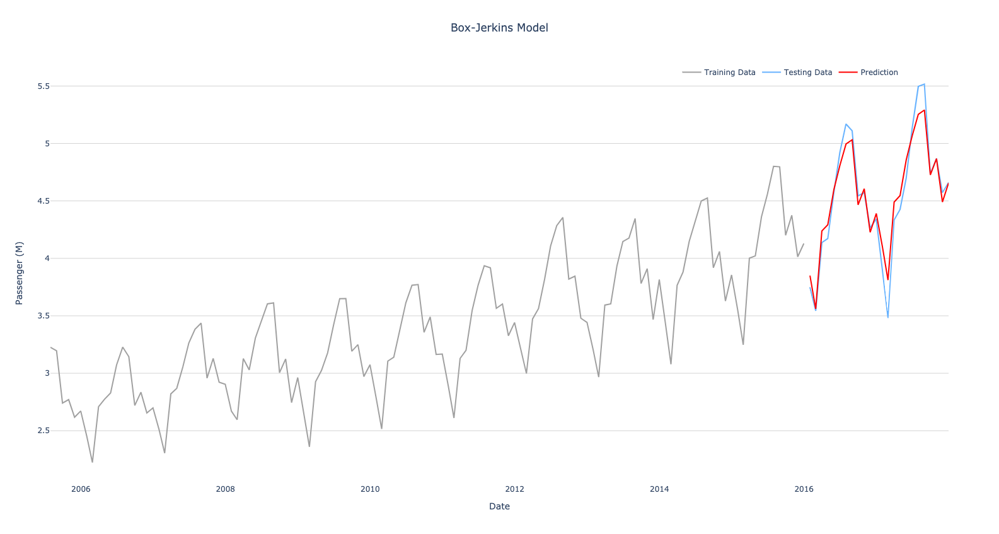
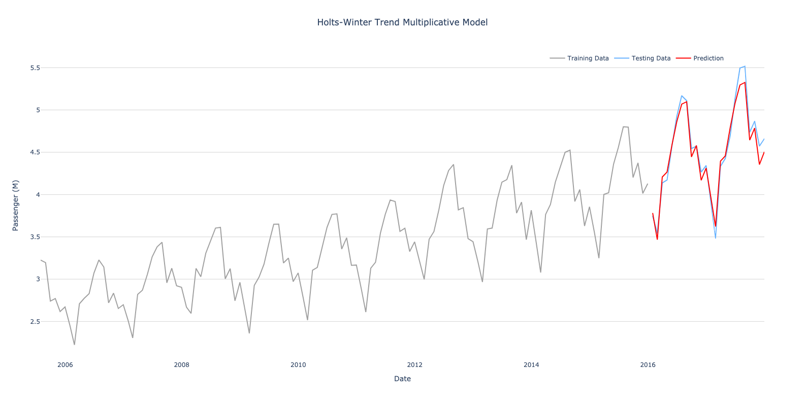
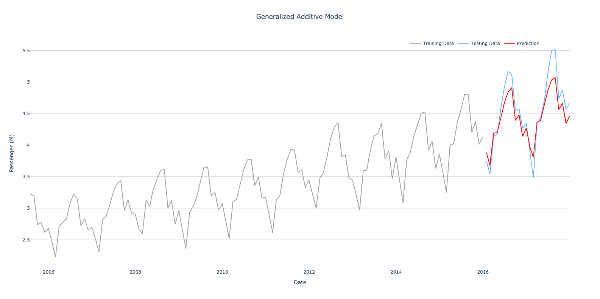
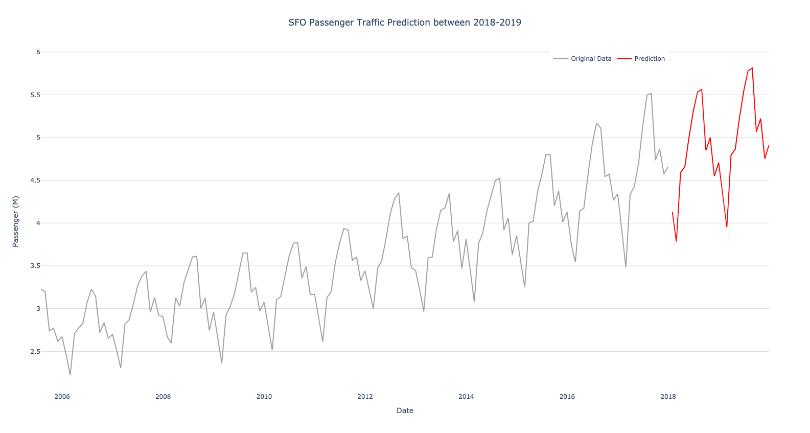

# Part 1.1 SFO Passenger Traffic Prediction (2018-2019)/Version 2

Part 1.1 follows up the Part 1 with updated code in Python. We have a data set on SFO traffic between July, 2005 and Decemeber, 2017. It includes the passenger counts on each airline every month in the given period. I have two goals for this project:
<ol>
	<li>Visualize the data set for EDA purpose</li>
	<li>Predict the passenger traffic and growth rate in 2018 and 2019</li>
</ol>
 
This part differs with Part 1 is to make prediction of passenger traffic between 2018-2019 with 2005-2017 data but using Python only. The EDA is also redone with Python packages instead of ggplot in R. 

## About the data set
The data set is an open source data set obtained from <a href="https://datasf.org/opendata/">Open SF</a>. It consists of 12 columns with 17,959 observations. For the convenience, the data set is cleansed and transformed for this part in the ETL process. The ETL process returns 2 csv files, 1 for EDA and 1 for model training. You may find more detail about the original data set, transformed data sets, and the ETL scripts in the [Data Folder](../Data). The data set is a time series data, and therefore, there are constraints to what we can do as some approches may violate some assumptions on certain algorithms, such as linear regression.

## Goal and Plan
The goal of this part of the project is to utilize the data set to predict the passenger traffic between 2018-2019 in SFO. In order to do this, we will take the following steps to achieve our goal: 
<ol>
	<li>Data Cleansing</li>
	<li>EDA</li>
	<li>Model Training</li>
	<li>Model Validation</li>
	<li>Prediction</li>
</ol>

## Files
In this part, the folder contains the following files:
<ul>
	<li>sfotraffic_arima.py</li>
	<li>sfotraffic_hw.py</li>
	<li>sfotraffic_prophet.py</li>
	<li>plot_pred</li>
	<li>sfotraffic_modeltraining.py</li>
	<li>sfotraffic_pred.py</li>
</ul>
 

### sfotraffic_arima.py
The file contains the following function:
<ul>
	<li>result_arima()</li>
</ul>
The file imports the following packages:
<ul>
	<li>pandas</li>
	<li>pmdarima</li>
	<li>mean_squared_error from sklearn.metrics</li>
</ul>
<i>pandas</i> is used for data managerment. <i>pmdarima</i> is for model training. <i>mean_squared_error</i> is used for calculating RMSE.
  
After <i>result_arima()</i> is called, the data is imported directly and transformed for model training, reformat date column and divide pax_count by 1 million. Then split the training data and testing data: data between 2005-2015 belongs to training data (year<=2015), 2016-2017(year>2015) belongs to testing data. The data set is static that the filter is fixed in 2015.
  
The function has calls <i>auto_arima()</i> which the function operates grid search to find the optimal model and return to you (Hyperparameter setting may be found in the Model Training section). After that, it makes prediction for the given period defined in the function parameter (Default at 24 months), and calculate the RMSE. The RMSE is only calculated with 24 months prediction (2016-2017) even the function parameter is greater than 24.
  
The function would finally declare a dictionary and return the following:
<ul>
	<li>result['summary']: Model summary - Object (Require users to convert to string)</li>
	<li>result['X_train']: Training data set - Dataframe</li>
	<li>result['X_test']: Testing data set - Dataframe</li>
	<li>result['pred']: Prediction between 2016-2017 with dates - Dataframe</li>
	<li>result['rmse']: RMSE - float</li>
</ul>
 
Both training data set and testing data set has date and passenger traffic in column names: <i>date</i> and <i>pax_count</i>. pred data frame has date and prediction in column name: <i>date</i> and <i>pred</i>.

### sfotraffic_hw.py
The file contains the following function:
<ul>
	<li>result_hw()</li>
</ul>
The file imports the following packages:
<ul>
	<li>pandas</li>
	<li>statsmodels.tsa.holtwinters</li>
	<li>mean_squared_error from sklearn.metrics</li>
</ul>
<i>pandas</i> is used for data managerment. <i>statsmodels.tsa.holtwinters</i> is for model training. <i>mean_squared_error</i> is used for calculating RMSE.
  
After <i>result_hw()</i> is called, the data is imported directly and transformed for model training, reformat date column and divide pax_count by 1 million. Then split the training data and testing data: data between 2005-2015 belongs to training data (year<=2015), 2016-2017(year>2015) belongs to testing data. The data set is static that the filter is fixed in 2015.
  
The function has calls <i>ExponentialSmoothing()</i> which fits data set and return the model. <i>ExponentialSmoothing()</i> is called twice, one for additive method and multiplicative method. the model with <i>model_add</i> is the model object trained with additive method, while <i>model_mul</i> is the model object trained with multiplicative method. After that, it makes prediction for the given period defined in the function parameter (Default at 24 months), and calculate the RMSE for both models. The RMSE is only calculated with 24 months prediction (2016-2017) even the function parameter is greater than 24.
  
The function would finally declare a dictionary and return the following:
<ul>
	<li>result['X_train']: Training data set - Dataframe</li>
	<li>result['X_test']: Testing data set - Dataframe</li>
	<li>result['pred_add']: Prediction between 2016-2017 with dates (Additive model)- Dataframe</li>
	<li>result['pred_mul']: Prediction between 2016-2017 with dates (Multiplicative model)- Dataframe</li>
	<li>result['rmse_add']: RMSE (Additive model) - float</li>
	<li>result['rmse_mul']: RMSE (Multiplicative model) - float</li>
</ul>
 
Both training data set and testing data set has date and passenger traffic in column names: <i>date</i> and <i>pax_count</i>. pred data frame has date and prediction in column name: <i>date</i> and <i>pred</i>.

### sfotraffic_prophet.py
The file contains the following function:
<ul>
	<li>result_gam()</li>
</ul>
The file imports the following packages:
<ul>
	<li>pandas</li>
	<li>prophet.Prophet (Facebook Prophet)</li>
	<li>mean_squared_error from sklearn.metrics</li>
</ul>
<i>pandas</i> is used for data managerment. <i>prophet.Prophet</i> is for model training. <i>mean_squared_error</i> is used for calculating RMSE.
  
Facebook Prophet follows sklearn syntax. The function first declare an object with <i>Prophet()</i>, then fit with training data. Lastly, it makes prediction for the given period defined in the function parameter (Default at 24 months), and calculate the RMSE for both models. The RMSE is only calculated with 24 months prediction (2016-2017) even the function parameter is greater than 24.
  
The function would finally declare a dictionary and return the following:
<ul>
	<li>result['X_train']: Training data set - Dataframe</li>
	<li>result['X_test']: Testing data set - Dataframe</li>
	<li>result['pred']: Prediction between 2016-2017 with dates (Additive model)- Dataframe</li>
	<li>result['rmse']: RMSE (Additive model) - float</li>
</ul>
 
Both training data set and testing data set has date and passenger traffic in column names: <i>date</i> and <i>pax_count</i>. pred data frame has date and prediction in column name: <i>date</i> and <i>pred</i>.

### plot_pred.py
The file contains the following function:
<ul>
	<li>plot_pred()</li>
</ul>
The file imports the following packages:
<ul>
	<li>pandas</li>
	<li>Plotly</li>
</ul>
<i>pandas</i> is used for data managerment. <i>Plotly</i> is used for generating visualizations.
  
<i>plot_pred()</i> required the following paramenters:
<ol>
	<li>X_train - Training data set</li>
	<li>X_test - Testing data set</li>
	<li>yhat - Prediction made from a predictive model</li>
	<li>model_name - Chart title</li>
	<li>html_filename - The filename of the html saved after the chart is generated</li>
</ol>
  
<i>plot_pred()</i> generates a line chart with 3 lines: Training data set in gray, testing data set in blue, and prediction in red. X-axis is the date dimension and y-axis is the passenger traffic in millions. The function is dynamic that can be used for result of different predictive models. <i>model_name</i> will be used as title. Once the chart is generated, it will saved in html with <i>html_filename</i>. Then, the chart can be downloaded in a png file, but the png required to be done manually.

### sfotraffic_modeltraining.py
This file imports the following scripts:
<ul>
	<li>sfotraffic_arima.py</li>
	<li>sfotraffic_hw.py</li>
	<li>sfotraffic_prophet.py</li>
	<li>plot_pred.py</li>
</ul>
The scripts first called the model training function from <i>sfotraffic_arima.py</i>, <i>sfotraffic_hw.py</i>, and <i>sfotraffic_prophet.py</i> and recieve an object contains RMSE, prediction. Then it would print the RMSE on the command line, and plot the prediction of each model by calling <i>plot_pred()</i> and save the plotly chart in html page in the [Images folder](/Images). Lastly, the script save the RMSE of all models and model summary of Box-Jerkins model in <i>ModelTrainingResults.txt</i> in the [Results folder](/Results).

### sfotraffic_pred.py
This file imports the following scripts:
<ul>
	<li>pandas</li>
	<li>statsmodels</li>
	<li>plotly</li>
</ul>
 
The script predicts the passenger traffic between 2018-2019 based on the optimal model found in the model training phase. It imports the data from <i>sfopax_month.csv</i> in the [Data Folder](../Data) and extract the data between 2005-2015 to train the model. Once the model is trained, it will produce the prediction between 2016-2019 from the model. After that, the script would plot the prediction between 2018-2019 and the data between 2005-2017 from <i>sfopax_month.csv</i>. Lastly, the script save the prediction between 2018-2019 and save as <i>sfopred.csv</i> in the [Results folder](/Results).

## Data Cleansing and ETL Process
The data cleansing part was done to keep entry records be more consistent. For example, some of the Continental Airlines entries was recorded "United Airlines - Pre 2013"; and some of the full service airlines were labeled as low cost carriers, while some low cost carriers were labeled as full cost carrier. For the convienence for both EDA and model training phases, the ETL process transformed the original data set to 2 different data set, <i>sfopax_eda.csv</i> and <i>sfopax_month.csv</i>. If you are interested what has done to improve the data quality, you may find more details in the [Data Folder](../Data) and [ETL Folder](../Data/ETL_part1_1). 

## EDA
The data set consists of data between 2005 and 2017. Before we build the predictive model, we shall understand more about the insights about the data set. You may learn more about the data set in the <a href="https://github.com/jacquessham/sfotraffic/tree/master/Part1_1/EDA">EDA folder</a>. The EDA process used <i>sfopax_eda.csv</i> as the data set contains more detail about the flights regards on airlines, destinations, and other details.
  
The annual passenger traffic looks like this:

## Model Training
### Strategy
The problem to times-series data is the each data point is highly correlated with data point(s) to the previous period(s), known as autocorrelation. It violates the assumption of linear regression. The best way to make prediction is to use time-series statistical learning methods like Box-Jerkins Method, Holt-Winters Method, and General Additive Model. There are 3 packages available in Python that I would use for the purpose:
<ul>
	<li><i>pmdarima</i> for Box-Jerkins Method</li>
	<li><i>statsmodels.tsa.holtwinters</i> for Holts-Winters Method</li>
	<li><i>Facebook Prophet</i> for General Additive Model</li>
</ul>
 
I would use <i>sfopax_month.csv</i> in the [Data Folder](../Data), which the data set is aggregated to monthly passenger count, to train the predictive models using the above packages in Python and validate which predictive models is the most accurated.
  
The data set would be splited to roughly 80:20 split for training and validating data set. The training set is roughly 10 years between 2005-2015; the remaining data from 2016-2017 is the validation set. RMSE would be used for model evaluation, whichever the model has the lowest RMSE is the most accurated model. We would choose that model to predict the passenger traffic between 2018-2019. 
  
<i>sfotraffic_modeltraining.py</i> is the script of driver script for model training. The script trains the predictive model with different algorithms first, then print the result and metrics on command line and save in text file afterward. <i>ModelTrainingResults.txt</i> in the [Results](/Results) folder contains such information.

### Approach 1: Box-Jerkins Method
Box-Jenkins Method is an autoregressive integrated moving average model which is learned by converting the data set into stationary. In this project, we use ARIMA and SARIMA models. The difference between the two is that ARIMA is non-seasonal while SARIMA is seasonal. <i>pmdarima</i>is a Python package similar to the <i>auto.arima()</i> in R's <i>forecast</i> package. Convienently, you may import <i>pmdarima</i> and use the same syntax <i>auto.arima()</i> to achieve the same goal in Python to find the best hyperparameters for your Box-Jerkins model.
 
The pmdarima package follows R style and syntax. The syntax is very similar to the forecast package in R but pmdarima only takes the responsive variable column, in our case, the pax_count column. The <i>auto.arima()</i> takes the the pax_count column, the range (minimum and maximum) of hyperparameters including: p, q, d, P, Q, D, m, then the <i>auto.arima()</i> would find the best model using Box-Jerkins methods (Both ARIMA and SARIMA while setting seasonal=True, turn off if seasonality is not a concern, so that SARIMA model is ignored).
 
<i>sfotraffic_arima.py</i> is the file that used this method to train the model.
  
The script has a function of <i>arima_model()</i> first imported the data from <i>sfopax_month.csv</i> and split the data to training and testing data set. Then, use <i>auto.arima()</i> to grid search the best model with the following hyperparameters:
<ul>
	<li>p (Trend autoregression order) between 1-6</li>
	<li>q (Trend moving average order) between 1-6</li>
	<li>P (Seasonal autoregression order) between 1-6</li>
	<li>Q (Seasonal moving average order) between 1-6</li>
	<li>d (Trend difference order) between 1-6</li>
	<li>D (Seaonal differece order) between 1-6</li>
	<li>m = 12 (Indicates a yearly seasonal cycle)</li>
	<li>seasonal = True (Indicates seasonality exist)</li>
	<li>trace = True</li>
	<li>stepwise = True</li>
</ul>
<i>auto.arima()</i> would return the best model in an object from the grid search, you may use .summary() to obtain the parameters of the model. Once the best Box-Jerkins model is found for this data set, the scripts predicts the passenger traffic between 2016-2017 and calculates the RMSE. Note that the RMSE is calculated based on passenger count in millions. If you would like to learn more how Box-Jerkins model works or understand the meaning of the hyperparameters, I recommend this <a href="https://machinelearningmastery.com/sarima-for-time-series-forecasting-in-python/">blog post</a> to learn more. 
 
This function is called in <i>sfotraffic_modeltraining.py</i> for model training phases.
   
The plot for the result is:

  
The RMSE of this model is 0.1340.

### Approach 2: Holts-Winters Method
Holt-Winters Methods predicts by using exponential smoothing techniques, in other words, the model is learned by taking an exponentially weighted moving average and do not need any assumption. The best package of Holts-Winters method is <i>statsmodels</i> in my opinion, where the function of <i>ExponentialSmoothing()</i> can be called in <i>statsmodels.tsa.holtwinters</i>.
 
The function allows you to smooth the trend in additive or multiplicative methods. For our purpose, we would train models with both methods and be validated in the model validation phase. <i>sfotraffic_hw.py</i> is the file that used this method to train the model. 
  
The script has a function of <i>result_hw()</i> first imported the data from <i>sfopax_month.csv</i> and split the data to training and testing data set. Then, the script use following hyperparameters to smooth the trend in additive method:
<ul>
	<li>trend = 'add' (To indicate additive method)</li>
	<li>seasonal_periods = 12 (Indicates a yearly seasonal cycle)</li>
</ul>
 
This model would be called the hw additive model.
  
Similarily, the script use following hyperparameters to smooth the trend in multiplicative method:
<ul>
	<li>trend = 'mul' (To indicate multiplicative method)</li>
	<li>seasonal_periods = 12 (Indicates a yearly seasonal cycle)</li>
</ul>
 
This model would be called the hw multiplicative model.
  
Once the models are trained, the scipt would predict the passenger traffic for 2016-2017 based on both models and obtain the RMSE for both models. At the end of the function, the following would be return in the <i>result</i> dictionary:
<ul>
	<li>Training Data set</li>
	<li>Testing Data set</li>
	<li>hw additive model prediction</li>
	<li>hw additive model RMSE</li>
	<li>hw multiplicative model prediction</li>
	<li>hw multiplicative model RMSE</li>
</ul>
 
This function is called in <i>sfotraffic_modeltraining.py</i> for model training phases.
 
The plot for the results are:

  

  
The RMSE of the hw additive model is 0.2077. 
The RMSE of the hw multiplicative model is 0.1037.

### Approach 3: Generalized Additive Model
The generalized additive model used non-linear predictors to fit the time-series data points in order to find the trend and seasonality. The model aims to use the nonlinear relationship to explain the distribution of the time-series data points. Facebook's Facebook Prophet is a Python package (Also available in R) is a good package for training the predictive model with this method. <i>sfotraffic_prophet.py</i> is the file that used this method to train the model. 
 
The function <i>gam_model()</i> in the script helps you to train the model with this package. Facebook Prophet follows sklearn style syntax, so after importing the data, the script declare an Prophet object and fit the data set with <i>.fit()</i>. Then, use <i>.predict()</i> to predict the passenger traffic between 2016-2017. Lastly, calculate RMSE. At the end of the function, the following would be return in the <i>result</i> dictionary:
<ul>
	<li>Training Data set</li>
	<li>Prediction</li>
	<li>RMSE</li>
</ul>
 
This function is called in <i>sfotraffic_modeltraining.py</i> for model training phases.
 
The plot for the results are:

  
The RMSE of this model is 0.2136.

## Model Validation
We are going to evaluate models with the lowest RMSE. We would first compare the RMSE among all models and verify the prediction is useful. The reason why we shall verify the prediction is useful because sometimes the predictive model is overtrained that sometimes it return a flat meaning take the average of the training data, so we have to make sure the prediction the model made is useful and appliable.

### Evaluation with RMSE
The RMSE of the models are:
<ul>
	<li>Box-Jerkins model: 0.1340</li>
	<li>Holts-Winter trend additive model: 0.2077</li>
	<li>Holts-Winter trend multiplicative model: 0.1037</li>
	<li>Generalized additive model: 0.2136</li>
</ul>
 
Based on the RMSE among all models, we conclude that <b>Holts-Winter trend multiplicative model</b> has the lowest RMSE and we would pick this model as the best model for prediction.

### Verification with Prediction
Let's recall the prediction chart for <b>Holts-Winter trend multiplicative model</b>:
  

 
By looking at the prediction chart, we can see that prediction is useful because the red line is able to catch the trend and seasonality. Therefore, we can use this model to predict the passenger traffic in 2018-2019.

## Result and Prediction
In this phase, we would use <i>sfotraffic_pred.py</i> to make prediction, save the prediction as csv file, and visualize on a line chart. This script only import packages including pandas, statsmodel, and plotly. The script would obtain the data set and retrain the model because we did not save the model previously, and make the prediction between 2016-2019. Since the model only trained with 2005-2015 data, we shall not include the data in 2016-2017 to train the predictive model. However, time-series data depends on previous period data, therefore, it is necessary to predict 2016-2017 in order to obtain the prediction between 2018-2019. Once the prediction in 2018-2019 is obtained, the result is saved as <i>sfopred.csv</i> in the [Results folder](/Results). The script also generate a line chart. The line chart consists 2 lines: data between 2005-2017 in gray line, and prediction between 2018-2019 in red line. Note that, the data points between 2016-2017 is plotted with the data from the original data set, <b>not the prediction</b>.
  
The passenger traffic between 2018-2019 we predict is the following:
<table style="width:75%">
	<tr>
		<th>Date (Month, Year)</th>
		<th>Passenger Traffic (Millions)</th>
	</tr>
	<tr>
		<td>Jan 2018</td>
		<td>4.13</td>
	</tr>
	<tr>
		<td>Feb 2018</td>
		<td>3.78</td>
	</tr>
	<tr>
		<td>Mar 2018</td>
		<td>4.59</td>
	</tr>
	<tr>
		<td>Apr 2018</td>
		<td>4.66</td>
	</tr>
	<tr>
		<td>May 2018</td>
		<td>5.01</td>
	</tr>
	<tr>
		<td>Jun 2018</td>
		<td>5.30</td>
	</tr>
	<tr>
		<td>Jul 2018</td>
		<td>5.53</td>
	</tr>
	<tr>
		<td>Aug 2018</td>
		<td>5.56</td>
	</tr>
	<tr>
		<td>Sep 2018</td>
		<td>4.85</td>
	</tr>
	<tr>
		<td>Oct 2018</td>
		<td>5.00</td>
	</tr>
	<tr>
		<td>Nov 2018</td>
		<td><4.55/td>
	</tr>
	<tr>
		<td>Dec 2018</td>
		<td>4.71</td>
	</tr>
	<tr>
		<td>Jan 2019</td>
		<td>4.31</td>
	</tr>
	<tr>
		<td>Feb 2019</td>
		<td>3.95</td>
	</tr>
	<tr>
		<td>Mar 2019</td>
		<td>4.80</td>
	</tr>
	<tr>
		<td>Apr 2019</td>
		<td>4.86</td>
	</tr>
	<tr>
		<td>May 2019</td>
		<td>5.23</td>
	</tr>
	<tr>
		<td>Jun 2019</td>
		<td>5.54</td>
	</tr>
	<tr>
		<td>Jul 2019</td>
		<td>5.78</td>
	</tr>
	<tr>
		<td>Aug 2019</td>
		<td>5.81</td>
	</tr>
	<tr>
		<td>Sep 2019</td>
		<td>5.07</td>
	</tr>
	<tr>
		<td>Oct 2019</td>
		<td>5.22</td>
	</tr>
	<tr>
		<td>Nov 2019</td>
		<td>4.75</td>
	</tr>
	<tr>
		<td>Dec 2019</td>
		<td>4.92</td>
	</tr>
</table>
  
And it could be visualized as follow:
 

## Reflection
Coming Soon...
   
