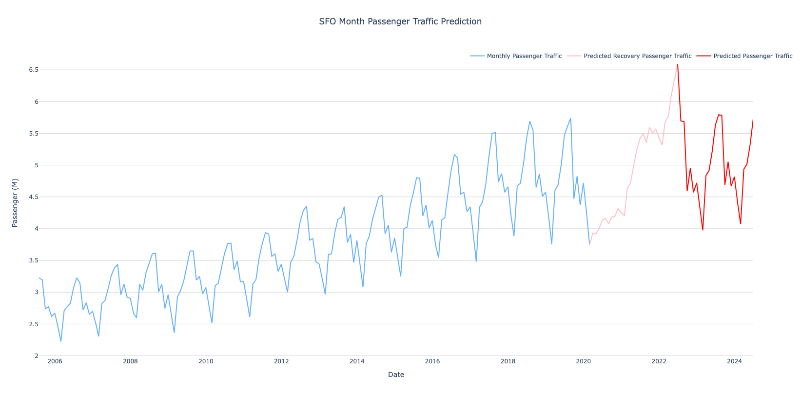

# Part 2.2 Refine SFO Passenger Traffic Prediction Model for Production
Part 2.2 will finalize the scripts from Part 2 in order to make prediction after downloading a dataset from <a href="https://data.sfgov.org/Transportation/Air-Traffic-Passenger-Statistics/rkru-6vcg">OpenSF</a> with extreme passenger traffic shock. The scripts will clean the dataset and display the prediction without any manual after input the required parameters.

## Terminology
<ul>
	<li>Extreme shock: The unexpected event that leads the passenger traffic drop rapidly</li>
	<li>Normal time/Normal months: The time or period when the passenger traffic is not affected by the shock. In other word, the passenger traffic growth rate is not growing in extreme rate</li>
	<li>Recovery Prediction: The prediction between the extreme shock and prediction back to normality</li>
	<li>Prediction after Recovery: Prediction after normality</li>
</ul>

## Instruction
After downloading the dataset from OpenSF, fill in the <i>params.json</i> file for configuration. By inputing the configuration, the script will predict both the recovery prediction and prediction after the recovery, and visualize automatically. The prediction will also be saved in your current directory if you indicate to export the prediction.
<br><br>
Please see the <i>Files</i> sections for instruction on filling out the <i>params.json</i> file for configuration.
<br><br>
Once <i>params.json</i> is filled, run

```
python sfo_pred.py
```


## Files
### params.json
This JSON file provides the inputs of how the program would run. You must fill in the following inputs:
<ul>
	<li>file: The dataset directory, only use the dataset downloaded from the OpenSF link</li>
	<li>pred_period: Months of prediction you want to make. You must enter an integer here.</li>
	<li>result_export_csv: Indicate whether if you want to export the prediction in CSV. If so, enter <i>true</i>. If true, the CSV would include both recovery prediction and prediction after recovery</li>
	<li>shock_date: The month when the shock happened, the format must be entered in YYYY-MM-DD. If not, the program will be halted</li>
	<li>recovery_reference: The recovery trend and seasonality to be utilized for the predict recovery prediction</li>
	<li>normality_before_shock: The last normal month. It is used to help making prediction after recovery</li>
	<li>shock_recovery: Recovery period in number of months after the shock happened</li>
	<li>seasonality_mod: The modifier to shrank the effect of seasonality. This field expects a float between 0 and 1. It is commended to adjust when <i>trend_mode</i> is set to <i>mul</i></li>
	<li>trend_mode: Additive or multiplicative for Trend in Holt-Winters Model. This field expects a string either <i>add</i> or <i>mul</i>. The result of Part 2 suggested to use <i>mul</i> but the growth may become unrealistic. You may change it to <i>add</i> to limit the growth for realistic prediction</li>
	<li>seasonal_mode: Additive or multiplicative for Seasonality in Holt-Winters Model. This field expects a string either <i>add</i> or <i>mul</i></li>
	<li>diff_pred: To indicate whether the visualization differentiate the recovery prediction and prediction after recovery. You may set <i>true</i> for differentiation, or <i>false</i> to ignore</li>
</ul>

#### shock_date vs. normality_before_shock
One of the reasons we separate <i>shock_date</i> and <i>normality_before_shock</i> is that we experience some unusual drop of passenger traffic before March, 2020 as some Asian countries started to close their border or downscale the flight frequency before the US closed its border in January, 2020. We do not want to take it account into the prediction model. Therefore, the prediction model should only takes data up to <i>normality_before_shock</i> to filter out the adnormality in the prediction model. It means, in reality, if we want to make prediction after air traffic resume in 2022 or 2023, the prediction, the prediction model should only use the data until December, 2019 which is the last normal month.

### sfo_pred.py
The driver script to trigger the data cleaning phase, prediction phase, and the visualization phase. Each phase will call functions from <i>etl_prod.py</i>,<i>hw_prod.py</i>,<i>viz_prod.py</i>, respectively.

### etl_prod.py
This script is response to read the dataset, clean the dataset, and transform to the format for prediction phase.

### hw_prod.py
This script takes the transformed data to train the predictive model with Holts-Winter method (Multiplicative Model by default), which is the model picked in [Part 2](../Part2). You may switch to Additive Model of by setting <i>add</i> on the <i>trend_mode</i> or <i>seasonal_mode</i>, trend and seasonality setting respectively, filed in the <i>params.json</i> file. You have to indicate the <i>pred_period</i> to indicate the months of prediction you want to make. <b>The recommended period is 24 months</b> and the model becomes less accurate when the predictive period is getting longer.

### viz_prod.py
This script visualize the dataset downloaded from OpenSF and the prediction. It has two functions to allow you to differentiate the recovery prediction and prediction after recovery on the visualization. You may set <i>true</i> on the <i>diff_pred</i> field in the <i>params.json</i> file.

## Scripts Workflow
<ol>
	<li>Read <i>params.json</i> to obtain the metadata</li>
	<li>Validate values entered in <i>params.json</i>, if not, the program will be halted</li>
	<li>Clean and transform the data downloaded from <i>OpenSF</i></li>
	<li>Make prediction based on Normal months (It is determined from the <i>normality_before_shock</i> field in <i>params.json</i>), this prediction will be used as Prediction after Recovery</li>
	<li>Shift the prediction date by a period defined in <i>shock_recovery</i> fieldin <i>params.json</i></li>
	<li>Predict the recovery prediction</li>
	<li>Visualize the data and prediction</li>
	<li>Export the result if <i>result_export_csv</i> is set to true</li>
	<li></li>
</ol>

## Example
Here is the example configuration. You can expect the shock is taken place in Feb, 2020 and takes 30 months to recover, and make a prediction for the next 24 months. The recovery period would be reference the trend and seasonality on Feb, 2009 and the following 30 months. It will also switch the prediction model to additive model, and visualize the dataset, recovery prediction, and prediction after recovery.

```
{
	"file":"../Data/Air_Traffic_Passenger_Statistics_2020.csv",
	"pred_period":24,
	"result_export_csv":true,
	"shock_date":"2020-02-29",
	"recovery_reference":"2009-02-28",
	"normality_before_shock":2,
	"shock_recovery":30,
	"seasonality_mod":0.3,
	"trend_mode":"add",
	"seasonal_mode":"add",
	"diff_pred":true
}
```

<br>
If you have use this configuration, the visualization would look something like this:



## Notes
<ul>
	<li>The reason we shift the prediction of the Prediction after Recovery in step 4 becuase we assume the prediction is a continuity of the normal time that the trend should not be disrupted by any shock event. Once the passenger traffic is recovered, the trend will be continued as no shock has been happened. Therefore, the prediction after recovery should based on the trend and seasonality in the normal time</li>
	<li>Although the result in Part 2.2 that the prediction should be based on Holt-Winters Multiplicative model, the prediction is not realistic that the passenger traffic growth rate is double after the recovery. It is recommend to switch to additive to obtain a more realistic prediction</li>
	<li><b>The program does not check whether the <i>recovery_reference</i> is the same month as <i>shock_date</i>, you should match the months in both field to make sure the seasonality prediction is consistent</b></li>
</ul>
