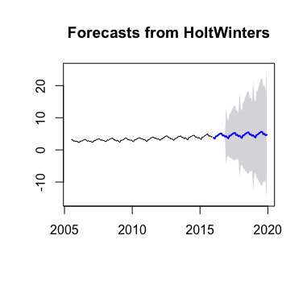

# SFO Traffic

We have a data set on SFO traffic between July, 2005 and Decemeber, 2017. It includes the passenger counts on each airline every month in the given period. I have two goals: 
1 - Visualize the data set for EDA purpose 
2 - Predict the passenger traffic in 2018 and 2019  

In this project, I will use R because I would like to demonstrate the functionality of ggplot and R has a better package for time series model. 

Noted that I have been doing EDA on this data set previously with Charles Siu. Some of the visualizations here is collaborative with him. 

## About the data set
The data set is an open source data set obtained from DataSF 
<a href="https://datasf.org/opendata/">Open SF</a>

The data set consists of 12 columns, 
the columns indicates the destination/origin with passenger counts the airline carry each month. 
As well as, the price type and boarding area of the airlines. 
 
In the given period, there are 17,959 observations.

## Data Cleansing
Before doing EDA, we shall change the column names for our convenience. 
After that, the columns we have are: 
1 - date 
2 - op_airlines 
3 - op_code 
4 - pub_airlines 
5 - pub_code 
6 - geo_summ 
7 - geo_region 
8 - type 
9 - price 
10 - terminal 
11 - boarding_area 
12 - pax_count 
 
#### Date
The date in the data set is in the format of YYYYMM, the first thing we should do is to split the year and month into two columns. That would append two more columns to the dataframe. Be sure to convert year in integer for convenience for modeling later.

#### op_airlines, op_code, pub_airlines, pub_code
Someties airlines may outsource the airplane operations to other airlines. For example, some region flights of United Airlines are operated by Skywest Airlines. While United Airlines is called published airlines, Skywest Airlines is called operation airlines. In this data set, the row for such flight, we would have Skywest Airlines in op_airlines and United Airlines in pub_airlines. op_code and pub_code are simply the IATA of operation and publish airlines.

#### geo_summ
The column indicates whether the flight is domestic or international. Flights from/to Canada are counted as international.

#### geo_region
The column indicates the region the flight is from/to.

#### type
Enplaned - Departure 
Deplaned - Arrival 
Thru/Transit - Transit flights

#### price
Low Fare or not. If the airline is not a low cost carrier, the data set indicates as "Other". We will change this to "Full Service" which is the proper term for airline contrast with low cost carrier

#### terminal
SFO has 3 domestic terminals, denoted as Terminal 1, 2, 3, and 1 international terminal, denoted as International.

#### boarding_area
The boarding_area the flight is embarked. In SFO, each terminal may have more than 1 boarding area but the boarding area code do not duplicated in other terminals.

#### pax_count
The passenger count, we can treat this as the response variable.

 
 
When we look at the data set in the previous project, we found that there are entries with inaccurate data or uncleaned data. Such as: 
1 - Some entries with United Airlines is recorded as United Airlines - Pre 07/01/2013 
2 - Emirates are typed inconsistently, some entries are typed with extra whitespace 
3 - Some airlines are recorded as low cost carrier but supposed to be full service ailrine, and the other way around 
 

# EDA
We have did some EDA for the data set, we have visualized: 
1 - Line Chart for passenger count by year  
 
2 - Bar Chart for passenger count with geo_summ by month 
 
3 - Line Chart for growth rate 
 
4 - Pie Chart for passenger type 
 
5 - Found the top 5 airlines in passenger counts by domestic and international 
 
6 - Bar Chart for passenger count for international low cost carrier 
 
7 - Tree map for terminal traffic 
 
8 - Heatmap for United Passenger count 
 

# Predict the passenger traffic in 2018 and 2019
#### Problem on time series data
Autocorrelation occurs in the data set, it means that a given data point is highly correlated with data point(s) from previous period. It violates one of the assumption of linear regression, so we need to predict in other approach. In this project, I will demostrate 3 approaches. 
 
We will split the whole data set about 80:20 split. The training set is roughly 10 years, or between 2005 and 2015. The reminding data of 2016 and 2017 is validation set.
 
 
We will use RMSE for model evaluation.

## Approach 1: Holt-Winters Method
Holt-Winters Methods predicts by using exponential smoothing techniques, in other words, the model is learned by taking an exponentially weighted moving average and do not need any assumption.  

The model plot is learned as follow: 

 
The RMSE of this model is 0.1946

 
The model was learned in additive exponentially weighted moving average. Another option is to use multiplicative exponentially weighted moving average.  

The model using multiplicative exponentially weighted moving average plot is below: 

 
The RMSE of this model is 0.1342

## Approach 2: Box-Jenkins Method
Box-Jenkins Method is an autoregressive integrated moving average model which is learned by converting the data set into stationary. In this project, we use ARIMA and SARIMA models. The difference between the two is that ARIMA is non-seasonal while SARIMA is seasonal.

#### ARIMA
For the sake of simplicity, we will use "auto.arima()" function to skip the steps on determine the hypermeters on ARIMA and SARIMA models. 
 
Using "auto.arima()" function found the best fit is ARIMA(0,1,0). 
The model plot is learned as follow: 

 
It looks like the forecast is constant, simply because our ARIMA model is fitted by only taking difference from the last period.  
The RMSE of this model is 0.6746

#### SARIMA
Using "auto.arima()" function found the best fit is SARIMA(0,1,0)(0,1,1)[12]. 
Using "auto.arima()" function found the best fit is ARIMA(0,1,0). 
The model plot is learned as follow: 

 
The RMSE of this model is 0.1812

## Approach 3: Linear Model
Recently, Facebook release a new time series package for R and Python called Facebook Prophet. You may find more information at <a href="https://facebook.github.io/prophet/">this website</a>. Therefore, I have given a shot to try to use.

However, only linear model is available in this package. Box-Jenkins Methods and Holt-Winters Methods are not available in this package.

The model plot is learned as follow: 

 
The RMSE of this model is 1.0493

## Result
Compare the RMSE among all models we learned, we found that multiplicative Holt-Winters is best on prediction. We will use this model to predict passenger counts between 2018 and 2019. 
The model plot is learned as follow: 

 
The result of prediction between January, 2018 and December 2019 are: 
